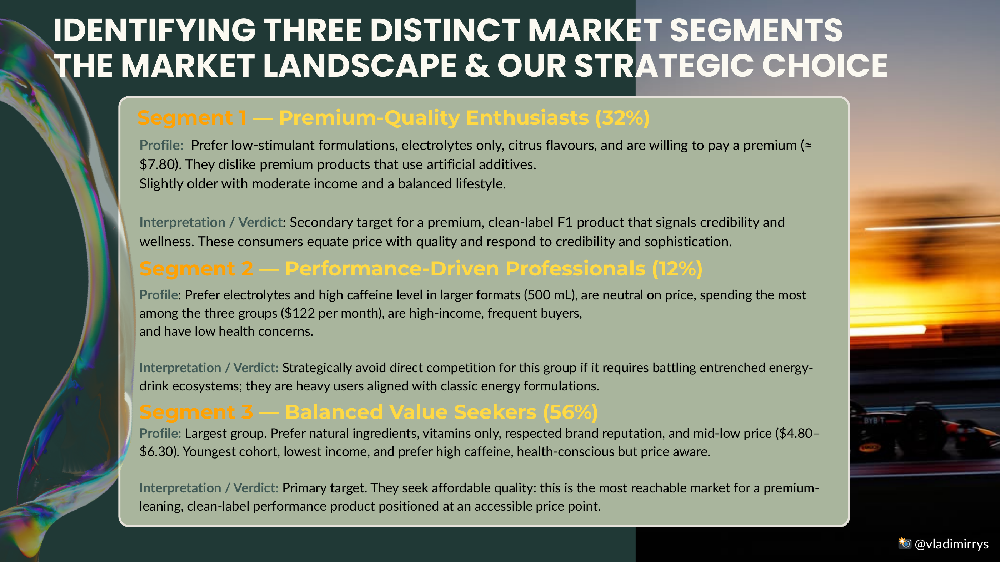
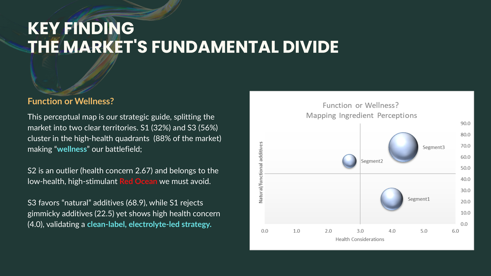
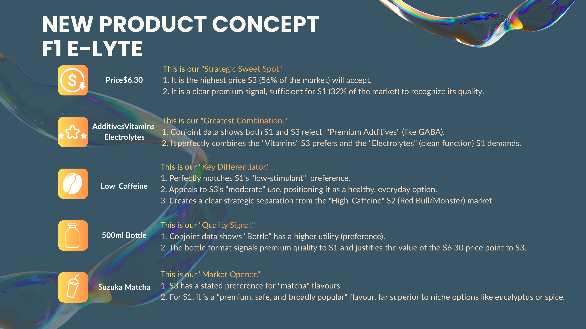

Consumer Segmentation & Conjoint-Driven Launch Strategy — Performance-Wellness Beverage
Survey analytics · segmentation · conjoint analysis · full-funnel go-to-market plan (Excel)
> Independent academic case study using the F1 brand as a hypothetical client. Not affiliated with or endorsed by Formula 1.

##Problem
The energy-drink category is a duopoly — Monster 43.3% and Red Bull 37.5% — and the obvious "race-fuel" product would put the hypothetical client in direct conflict with its most important commercial partner. The question was reframed: instead of selling another energy drink, can the brand's equity in innovation and prestige lead the premium performance-wellness category?

##Data
Consumer survey covering demographics, consumption behaviour and brand attitudes, plus a conjoint exercise across five attributes: flavour, caffeine level, packaging, additives, and price ($3.80–$7.80).
Key behavioural baseline: 92% already consume the category monthly; 78–86% are entrenched with the two incumbents — no blank slates.

##Method
Segmentation of survey responses into three groups: Premium-Quality Enthusiasts (32%), Performance-Driven Professionals (12%), Balanced Value Seekers (56%).
Conjoint attribute design and per-segment utility read-out.
Perceptual maps (health consideration × natural-additive preference; monthly spend × brand perception) to locate the white space and expose false signals.

##Findings & recommendation
88% of the market (S1 + S3) sits in wellness territory — that is the battlefield. S2's high spend ($122/month) is a false signal: entrenched loyalists looking for another Red Bull, strategically avoided.
The core tension is a price-perception clash: S1 reads price as quality (≈$7.80 acceptable), S3 caps at $6.30. The product concept resolves the clash at $6.30 — low caffeine, vitamins + electrolytes, 500 ml bottle, matcha flavour — with every attribute traced to a measured conjoint preference rather than taste.
Execution: funnel-staged SEM keyword plan, segment-specific PPC copy (quality-signal ads for S1, value-signal ads for S3, one "bridge" ad), UGC-led social plan, and a $6k / 6-month budget allocation.
##So what
> 
A complete chain — survey → segmentation → conjoint → product concept → media plan — where each product and pricing decision is justified by a measured preference. The same discipline transfers to any launch, pricing or positioning question.
Repo contents
```
slides/   selected deck pages (PNG)
README.md
```



